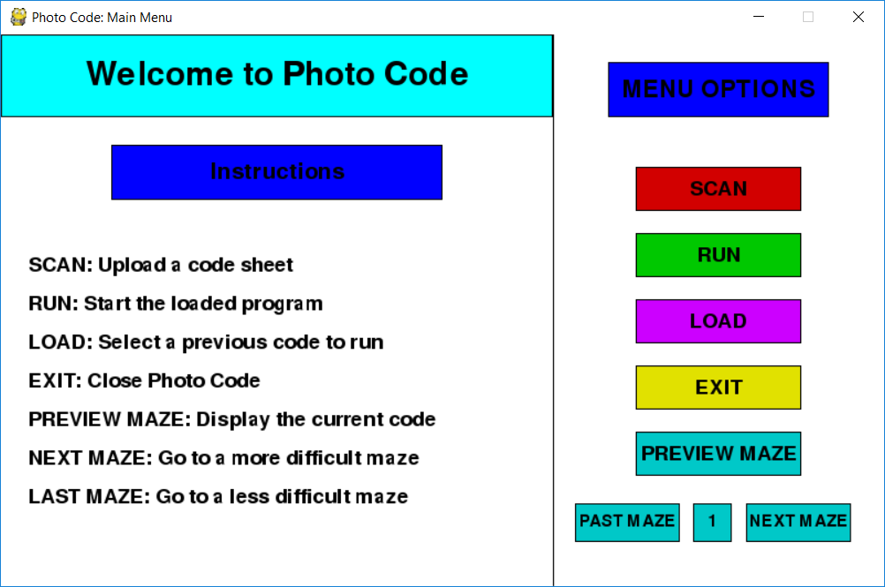
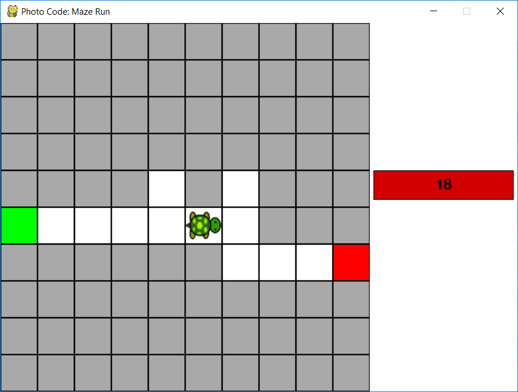

# Photo Code

`Photo Code` is an environment for young kids to learn fundamental programming concepts in an engaging, interactive way.  
Kids arrange pieces of paper on a table to write their code. Then they upload a photo of the table to `Photo Code` which analyzes the photo and simulates the code they wrote by moving a turtle around a maze.  
This allows kids to observe the effects of their code in order to think critically and make modifications.

## Usage

First compile `Frodo.exe` from the `Frodo/` folder (or use the included binary).  
This is the QR decoder that scans `.png` images for QR codes, and dumps the contents to `script.frodo`.  
It depends on `zlib.dll` and `libpng16.dll`, which have been included for convenience.  
`Frodo.exe` uses [**quirc**][quirc], a QR decoder library written by Daniel Beer.  
Currently, `Frodo.exe` has a greater success rate if you first apply a threshold on the `.png` image in a program like GIMP to make the image pure black/white.  
(See `test.png` and `test_orig.png`.)

Next, make sure you have `python3` and `pygame` installed.

Next, print out the sheets in the `pdfs/` folder. These are the keywords used to write code. Cut out each rectangle in the sheets along the lines.

Then run `main.py`.  
Upload an image using the "SCAN" button. This runs `Frodo.exe` and creates `script.frodo`.  
Then click the "LOAD" button. This reads `script.frodo` and creates the equivalent python code in `solver.py`.  
After selecting the maze you want to test, click the "RUN" button which runs `solver.py` to control the turtle.  
The turtle has 20 seconds to reach the goal. After the turtle reaches the goal or the time expires, you will be returned to the main menu.

[quirc]: https://github.com/dlbeer/quirc
